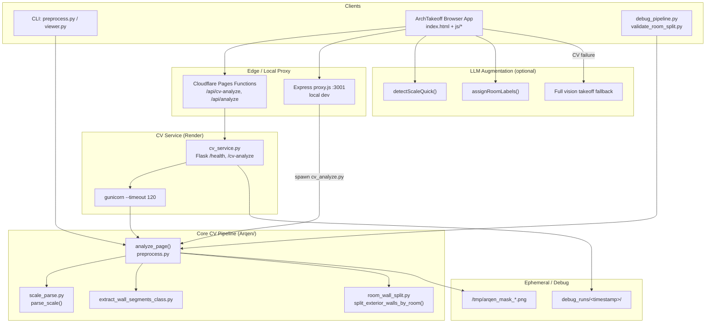
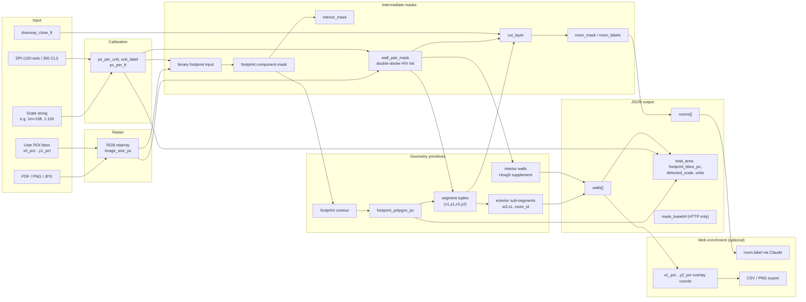

# Arqen Codebase Analysis

**Arqen** is an architectural takeoff system that extracts wall measurements, facing directions, room cells, and building area from floor-plan images/PDFs. It has two analysis tracks:

1. **Production CV pipeline** — deterministic OpenCV (`preprocess.py` → `cv_service.py`)
2. **ArchTakeoff web app** — CV-first with Claude vision fallback and LLM room-label enrichment

The authoritative implementation is `Arqen/preprocess.py` (~2,075 lines). `Arqen/segmentation_pipeline/` is an older fork and should not be treated as current behavior.

---

## 1. Architecture Diagram



### Component roles

| Layer | Key files | Role |
|-------|-----------|------|
| Orchestration | `preprocess.py` | Full CV pipeline, `analyze_page()`, `detect_wall_at_point()` |
| HTTP | `cv_service.py` | Production API wrapper, mask base64 encoding |
| Geometry helpers | `extract_wall_segments_class.py`, `room_wall_split.py`, `scale_parse.py` | Polygon→segments, room split, calibration |
| Web UI | `claude_demo/arch-takeoff/` | Upload, ROI, analysis, export |
| Deploy | `render.yaml` | Render `arqen-cv` service |
| Debug | `debug_pipeline.py`, `validate_room_split.py` | Stage PNGs, regression probes |

---

## 2. Data Flow Diagram



### Output schema (production `analyze_page`)

```json
{
  "detected_scale": "1in=16ft",
  "total_area": "8702.1 ft²",
  "units": "imperial",
  "px_per_ft": 9.38,
  "image_size_px": [w, h],
  "footprint_polygon_px": [[x,y], ...],
  "footprint_bbox_px": [x0, y0, x1, y1],
  "rooms": [{ "id": "R1", "area_px", "centroid_px", "bbox_px", "area", "area_raw" }],
  "walls": [{
    "id": "w3.s1", "name", "facing": "North|South|East|West",
    "length", "length_raw", "angle_deg", "px_coords": [x1,y1,x2,y2],
    "is_exterior": true, "room_id": "R14",
    "parent_wall_id": "w3", "segment_index", "segment_count"
  }],
  "mask_cache_path": "/tmp/...",
  "mask_roi_offset": [ox, oy]
}
```

---

## 3. Extraction Pipeline Map

```mermaid
flowchart TD
    S0["[0] Input<br/>PDF→raster OR base64 image"]
    S1["[1] ROI crop<br/>_crop_to_roi() — optional"]
    S2["[2] Scale calibration<br/>parse_scale() → px_per_unit"]
    S3["[3] Preprocess<br/>preprocess()"]
    S3a["3a. _extract_wall_lines() ×2<br/>full mask + margin-filtered mask"]
    S3b["3b. _find_wall_pairs() — double-stroke filter"]
    S3c["3c. _strip_spanning_grid_lines()"]
    S3d["3d. Downscale ÷4 → dilate → directional CLOSE<br/>bridge gaps ≤12 real units → upscale"]
    S4["[4] Footprint detection<br/>find_footprint() + flood_fill_interior()"]
    S5["[5] Contour + polygon<br/>find_footprint_contour() → simplify_polygon()"]
    S6["[6] Exterior segments<br/>extract_wall_segments()"]
    S6a["polygon_to_segments → filter_short → filter_non_orthogonal → merge_collinear"]
    S7["[7] Segment filter<br/>_filter_wall_segments() — poly ROI / exclusion"]
    S8["[8] Snap to ink<br/>snap_segments_to_walls()"]
    S9["[9] Room split<br/>split_exterior_walls_by_room()"]
    S9a["9a. detect_hough_segments() + find_interior_segments()"]
    S9b["9b. build_room_label_map() — cut_layer + doorway CLOSE"]
    S9c["9c. walk_wall_and_split_by_room() → runs_to_sub_segments()"]
    S10["[10] Interior supplement<br/>_hough_supplement()"]
    S10a["filter → snap → segment_traces_exterior() reject"]
    S10b["merge_and_deduplicate_segments()"]
    S11["[11] Measure + facing<br/>measure_walls() + assign_segment_facings()"]
    S12["[12] Cleanup<br/>cleanup_wall_list() — 6 dedup passes"]
    S13["[13] Length filter + fallbacks<br/>≥8 ft interior; top-12/20 if empty"]
    S14["[14] Coordinate remap<br/>shift px_coords if ROI used"]
    S15["[15] JSON emit<br/>walls, rooms, area, mask cache"]

    S0 --> S1 --> S2 --> S3
    S3 --> S3a --> S3b --> S3c --> S3d
    S3d --> S4 --> S5 --> S6
    S6 --> S6a --> S7 --> S8 --> S9
    S9 --> S9a --> S9b --> S9c
    S9c --> S10
    S10 --> S10a --> S10b --> S11 --> S12 --> S13 --> S14 --> S15
```



### Debug stage mapping (`debug_pipeline.py`)

| Stage PNG | Pipeline step |
|-----------|---------------|
| `01_mask_full` | Wall-pair mask extraction |
| `02_mask_filtered` | Margin-filtered mask |
| `03_exclusion_zones` | Sheet-fraction exclusion overlay |
| `04_binary_footprint_input` | Post-morphology binary |
| `05_footprint_component` | `find_footprint` result |
| `06_polygon_and_poly_roi` | Simplified polygon + filter ROI |
| `07_polygon_segments` | Raw polygon segments |
| `08_hough_fates` | Hough candidate filtering |
| `09_combined_before_dedup` | Exterior + interior combined |
| `10_after_dedup` | Post `merge_and_deduplicate_segments` |
| `11_final_walls` | Post `cleanup_wall_list` |
| `12_room_mask` / `13_cut_layer` / `14_exterior_splits` | Room split substages |

---

## 4. Supported Geometry Objects

### Input / control geometry

| Object | Format | Where |
|--------|--------|-------|
| Raster image | `np.ndarray` RGB | PDF rasterization, HTTP base64 |
| PDF page | Multi-page via PyMuPDF | `pdf_to_images()` |
| User ROI | `{x0_pct, y0_pct, x1_pct, y1_pct}` | Web UI, `analyze_page(roi=)` |
| Scale string | `1/4in=1ft`, `1:100`, arch feet-inches | `parse_scale()` |
| Click point | `(x_pct, y_pct)` | `detect_wall_at_point()` |

### Intermediate geometry (internal, some exposed in debug)

| Object | Description |
|--------|-------------|
| Binary mask | Thresholded ink after preprocessing |
| Wall-pair mask | Double-stroke H/V wall ink only |
| Exclusion zones | Sheet-fraction regions (title block, margins) |
| Footprint mask | Largest valid connected component |
| Contour | OpenCV external contour of footprint |
| Simplified polygon | `approxPolyDP` vertices |
| Line segment | `(x1, y1, x2, y2)` tuple — orthogonal only |
| Interior mask | Eroded footprint fill |
| Cut layer | Wall ink + interior partition lines |
| Room label map | Connected-component integer labels |
| Wall adjacency graph | Per-segment neighbor lists |

### Output geometry (consumer-facing)

| Object | Fields / constraints |
|--------|----------------------|
| Building footprint polygon | `footprint_polygon_px[]` |
| Footprint bounding box | `footprint_bbox_px` |
| Exterior wall | `is_exterior: true`, cardinal `facing`, `length`, `px_coords` |
| Exterior sub-segment | `id: "wN.sM"`, `parent_wall_id`, `room_id`, `segment_index` |
| Interior partition wall | `is_exterior: false`, orthogonal H/V via Hough |
| Room cell | `id: "R1"`, `area`, `centroid_px`, `bbox_px` (geometric, not OCR) |
| Room label (web only) | `label` via Claude `assignRoomLabels()` |
| Total building area | `total_area` from contour area ÷ `px_per_unit²` |
| Facing direction | `North`, `South`, `East`, `West` (image-up = North) |
| Measurement units | Imperial (ft) or metric (m) output |

### Supported drawing assumptions

- Orthogonal walls only (±10° tolerance)
- Walls drawn as **double parallel strokes** (wall-pair filter)
- Single building per sheet (largest footprint component)
- Floor-plan footprint view (not elevation/section in CV path)
- Scale formats: equality (`1in=16ft`) and ratio (`1:100`)

---

## 5. Unsupported Geometry Objects

| Category | Object | Status | Evidence |
|----------|--------|--------|----------|
| Openings | Doors | Not detected as geometry | Only `doorway_close_ft` morphology bridging |
| Openings | Windows | Not detected | Bridged in footprint close; Claude prompt only |
| Openings | Generic openings | Not modeled | README future: DeepFloorplan/RoomFormer |
| Topology | Wall junctions / nodes | Not modeled | Segment list only, no graph |
| Topology | Wall thickness | Implicit in pair gap, not output | — |
| Angles | Curved walls | Unsupported | `filter_non_orthogonal_segments()` drops them |
| Angles | Diagonal / non-rectilinear walls | Unsupported | Same filter |
| Angles | North rotation | Not implemented | `--north-up` in docstring, no CLI flag |
| Building | Multi-building sheets | Unsupported | Single largest component |
| Building | Attached garages / wings as separate structures | Partial | Only if connected in footprint |
| Plan types | Site plans | CV unsupported | Web UI option; CV assumes floor plan |
| Plan types | Elevations / sections | CV unsupported | Web UI option only |
| Fixtures | Stairs, columns, fixtures | Not detected | — |
| Rooms | Room name OCR (CV) | Not in CV | LLM enrichment only |
| Rooms | Room polygon boundaries | Not exported | Only bbox + centroid |
| Scale | Meters on real-world side (`3m`) | Commented out | `scale_parse.py` line 89 |
| Scale | Auto scale detection (CV) | Not in CV | Claude `detectScaleQuick()` only |
| Measurements | Window counts per wall | LLM only | `test_pdfs.py` prompt schema |
| Measurements | Per-opening dimensions | Not supported | — |
| Interaction | Wall edit / correction | Not supported | Read-only output |
| Legacy | Flat `w1` walls without room split | Deprecated output | `out.json` sample is pre-room-split |

---

## 6. Top 20 Likely Failure Points

Ranked by frequency × severity × debug difficulty:

| # | Failure point | Stage | Symptom | Root cause |
|---|---------------|-------|---------|------------|
| 1 | **Scale parse failure** | `[2]` | HTTP 500 / crash | Unsupported format, wrong DPI, meters not parsed |
| 2 | **No building footprint** | `[4]` | `{"error": "No building footprint found"}` | Close kernel too large (merges sheet) or too small (broken footprint) |
| 3 | **Wrong footprint component** | `[4]` | Wrong area, missing walls | Title block/grid picked over building; multi-building sheet |
| 4 | **Wall-pair filter false negatives** | `[3a]` | Missing exterior walls | Single-stroke walls, faint scans, non-standard lineweight |
| 5 | **Wall-pair filter false positives** | `[3a]` | Spurious segments later dropped | Dimension strings paired with nearby ink |
| 6 | **Morphological close overshoot** | `[3d]` | Entire ROI becomes one blob | `close_k_size` too large relative to downscaled image |
| 7 | **Doorway gap not bridged** | `[3d]` | Footprint splits at openings | Close kernel too small for wide openings |
| 8 | **Exclusion zones clip building** | `[7]` | Top/bottom walls missing | Full-sheet mode; building fills sheet margins |
| 9 | **Polygon simplification loss** | `[5]` | Bays/recesses lost | `epsilon_factor` too aggressive; interior walls needed via Hough |
| 10 | **Non-orthogonal edges dropped** | `[6]` | Angled wings absent | `filter_non_orthogonal_segments()` |
| 11 | **Snap-to-ink failure** | `[8]` | Segment offset from true wall | No wall-pair pixels near simplified polygon edge |
| 12 | **`doorway_close_ft` too low** | `[9b]` | Rooms incorrectly merged | Door openings not sealed in cut_layer |
| 13 | **`doorway_close_ft` too high** | `[9b]` | Rooms incorrectly split | Unrelated spaces connected across corridors |
| 14 | **Room area threshold** | `[9b]` | Small rooms omitted | `min_room_ft2=25` filter |
| 15 | **Hough false interior walls** | `[10]` | Spurious interior partitions | Grid residue, furniture lines, annotation ink |
| 16 | **Hough misses interior walls** | `[10]` | Missing partitions | Polygon-only exterior path; faint interior lines |
| 17 | **Dedup drops real walls** | `[12]` | Spanning duplicate removal | `coaxial_spanning`, `dimension_like`, `coaxial_merge` over-aggressive |
| 18 | **Dedup keeps false walls** | `[12]` | Duplicate/overlapping measurements | Tuned thresholds wrong for scale |
| 19 | **DPI / scale mismatch** | `[2]` | Systematic length error | Web 150 DPI vs CLI 300 DPI with same scale string |
| 20 | **Production timeout** | Service | 502 / empty response | `gunicorn --timeout 120`, free-tier Render, large high-DPI images |

### Additional operational failure points

- **ROI required in web app** — analysis blocked without `buildingRoi` (`analysis.js`)
- **Coordinate space mismatch** — footprint-relative vs image-relative in overlays (`coords.js`)
- **Claude fallback variance** — non-deterministic lengths, JSON parse failures, token truncation
- **No CI regression suite** — silent quality regressions across the 14-stage pipeline
- **Stale `segmentation_pipeline/` fork** — risk of running wrong code path

---

## 7. Recommended Roadmap to Production-Grade Reliability

### Phase 0 — Measurement foundation (weeks 1–3)

**Goal:** Know when the system is wrong before users do.

1. **Golden dataset** — Curate 30–50 annotated plans covering scale variants, ROI crops, L-shaped/T-shaped footprints, dense interior partitions, poor scans.
2. **Automated regression harness** — Extend `validate_room_split.py` + `debug_pipeline.py` into pytest:
   - Wall count / length tolerance per plan
   - `assert_no_coaxial_spanning_duplicates`
   - Footprint area tolerance
   - Per-stage probe-box survival checks
3. **CI pipeline** — Run regression on every PR; fail on threshold breach.
4. **Canonical output schema** — Version the JSON schema; deprecate flat `w1` format.

### Phase 1 — Pipeline hardening (weeks 3–8)

**Goal:** Reduce the top 10 CV failure modes without ML.

1. **Scale robustness**
   - Finish meters parsing (`scale_parse.py` line 89)
   - Auto-detect scale bar from image (CV, not LLM)
   - Validate `px_per_unit` sanity bounds; reject implausible calibration
2. **Footprint reliability**
   - Parameterize `close_k_size`, exclusion zones, component scoring via config (not hard-coded fractions)
   - Add confidence score: component area ratio, compactness, edge-touch penalty
   - Return partial results with warnings instead of hard `error` when footprint is weak
3. **Dedup safety**
   - Make cleanup passes idempotent and logged per-wall (which pass dropped which wall)
   - Separate exterior vs interior dedup policies
   - Add "recover dropped walls" fallback when count drops >30% in cleanup
4. **Room split tuning**
   - Auto-estimate `doorway_close_ft` from detected opening widths in wall mask
   - Expose confidence per room (area, compactness, label stability)

### Phase 2 — Observability & serving (weeks 6–10)

**Goal:** Production operability.

1. **Structured logging** — Per-stage timings, counts, cleanup stats (already partially in stderr; formalize as JSON logs).
2. **Request tracing** — Correlate `debug_runs/<timestamp>` with request IDs in production (`ARQEN_DEBUG_DUMP` sampling).
3. **SLOs** — p95 latency <60s, success rate >95% on golden set, length MAPE <5% on exterior walls.
4. **Render upgrades** — Paid tier, 2+ workers, async job queue for large PDFs (avoid 120s timeout).
5. **Input validation** — Max image dimensions, scale preflight, ROI bounds checks before expensive CV.

### Phase 3 — Hybrid ML augmentation (weeks 10–16)

**Goal:** Replace brittle heuristics where they fail most (per README direction).

1. **Evaluate** DeepFloorplan / Floor-SP / RoomFormer on golden set.
2. **Hybrid architecture:**
   - ML → wall graph + room segmentation
   - Existing pipeline → measurements, facing, scale calibration, dedup
3. **Fallback chain:** ML → CV heuristics → Claude vision (last resort only).
4. **A/B testing** — Compare ML-hybrid vs current pipeline on golden set before cutover.

### Phase 4 — Opening & topology (weeks 16–24)

**Goal:** Complete takeoff geometry beyond walls.

1. Door/window detection as first-class objects (position, width, host wall).
2. Explicit junction graph (wall endpoints, connectivity).
3. Room boundary polygons (not just bbox).
4. Optional north-arrow rotation correction.

### Phase 5 — Product reliability (ongoing)

1. **User correction loop** — Click-to-adjust wall endpoints; persist corrections as training data.
2. **Confidence UX** — Per-wall confidence badges; flag low-confidence for human review.
3. **Deterministic primary path** — Claude only for labels/scale, never for measurements.
4. **Documentation** — Supported plan types, scale formats, ROI requirements, known limitations.
5. **Retire `segmentation_pipeline/`** — Archive or delete stale fork to prevent confusion.

### Priority matrix (what to do first)

| Priority | Item | Impact | Effort |
|----------|------|--------|--------|
| P0 | Golden dataset + CI regression | High | Medium |
| P0 | Scale/DPI validation | High | Low |
| P0 | Per-stage metrics + sampled debug dumps | High | Low |
| P1 | Footprint confidence + parameterized morphology | High | Medium |
| P1 | Dedup audit trail + safer fallbacks | High | Medium |
| P2 | Auto `doorway_close_ft` | Medium | Medium |
| P2 | Async job queue for large inputs | Medium | Medium |
| P3 | ML hybrid wall graph | Very high | High |
| P4 | Door/window objects | High | High |

### Current maturity assessment

| Dimension | Status |
|-----------|--------|
| Core CV algorithm | Advanced prototype — heavily tuned, scale-adaptive |
| Room-aware exterior walls | Recently integrated, manually validated |
| Test coverage | Ad-hoc scripts only; no pytest/CI |
| Production deploy | Render + Cloudflare; 120s timeout, single worker |
| Determinism | CV path deterministic; web path hybrid with LLM |
| Geometry completeness | Walls + rooms + area; no openings/topology |
| Documentation | README covers run instructions; no architecture docs |

The system is well-suited for **controlled demos and iterative tuning on known plan types**. Production-grade reliability requires Phase 0–2 before trusting automated takeoffs on arbitrary customer drawings.

---

## 8. Dependencies & Environment

### Runtime Python packages (`Arqen/requirements.txt`)

| Package | Constraint | Used by | Role |
|---------|-----------|---------|------|
| `opencv-python-headless` | `>=4.9` | All CV modules | Thresholding, morphology, contours, Hough, connected components |
| `numpy` | `>=1.26` | All CV modules | Mask/array math |
| `PyMuPDF` (`fitz`) | `>=1.24` | `preprocess.pdf_to_images()`, `viewer.py` | PDF rasterization |
| `flask` | `>=3.0` | `cv_service.py` only | HTTP API (`/health`, `/cv-analyze`) |
| `gunicorn` | `>=22.0` | Render deploy only | WSGI server, `--timeout 120 --workers 1` |

The core pipeline (`preprocess.py`, `scale_parse.py`, `extract_wall_segments_class.py`, `room_wall_split.py`) needs only **OpenCV + NumPy** (+ PyMuPDF when the input is a PDF). Flask/gunicorn are service-layer only.

### Dev / test packages (`requirements-dev.txt`, repo root)

| Package | Role |
|---------|------|
| `pytest` | Unit + integration suite (`tests/`) |
| `flask` | Required to import `cv_service` in HTTP-layer tests |
| `jsonschema` | Validate `ground_truth.json` / prediction shapes against `validation/schema/` |

The validation scorer (`validation/arqen_validation/`) is pure Python + NumPy; `validation/run_score.py --run-pipeline` additionally needs OpenCV + PyMuPDF.

### Environment variables

| Variable | Where read | Effect |
|----------|-----------|--------|
| `ARQEN_DEBUG_DUMP` | `cv_service.py` | `=1` saves each request to `Arqen/debug_runs/<timestamp>/` (`image.png` + `request.json`) |
| `SERVICE_SECRET` | `cv_service.py` | If set, requires `X-Service-Secret` header on `/cv-analyze` |
| `PORT` | `cv_service.py`, `render.yaml` | HTTP bind port (default 8000) |

The core CV modules read **no** environment variables; behavior is controlled entirely by function arguments (`scale_str`, `dpi`, `roi`, `doorway_close_ft`, `room_debug_dir`).

### DPI conventions

| Caller | DPI | Note |
|--------|-----|------|
| Web app (`cv_analyze.py`, captures) | 144–150 | Captured in `request.json` per run |
| CLI (`preprocess.py main()`) | 300 | Module default `DPI = 300` |

`px_per_unit` scales linearly with DPI, so the same scale string at a different DPI changes every pixel-space tolerance. Always pass the DPI the raster was produced at.

### Deploy surface (`render.yaml`)

- Render web service `arqen-cv`, `rootDir: Arqen`, free plan, single worker, 120 s timeout.
- Health check: `/health`. Auth: auto-generated `SERVICE_SECRET` (mirrored into Cloudflare Pages as `CV_SERVICE_SECRET`).
- No Python version pinned in deploy config; local dev verified on Python 3.14 / OpenCV 4.11 / NumPy 2.4.

### Determinism

The CV path has no randomness (no `random`/`np.random`). For fixed `image`, `scale_str`, `dpi`, `roi`, `doorway_close_ft`, and OpenCV version, output geometry is deterministic — the only run-to-run variance is the `uuid4` temp-mask filename. This is what makes golden-snapshot regression baselines (`validation/baselines/`) viable.
