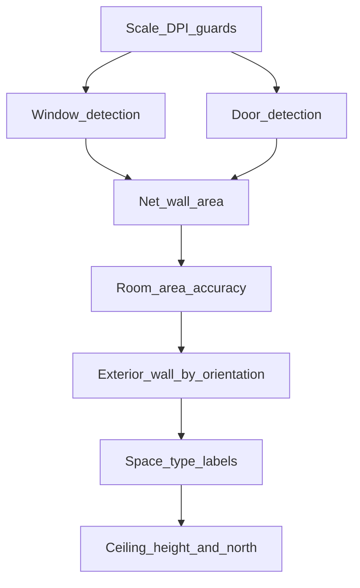

# Floor Plan Extraction System Analysis

**Date:** 2026-06-10  
**Scope:** Production CV pipeline, web enrichment layer, validation schema, and HVAC downstream requirements.

**Assumption:** HVAC requirements follow Manual J / ASHRAE residential load conventions. Commercial workflows (ASHRAE 90.1, EnergyPlus) may need additional objects (plenum zones, vestibule airlocks, process loads) not covered here.

**Sources:** [`Arqen/preprocess.py`](../Arqen/preprocess.py), [`Arqen/ARCHITECTURE.md`](../Arqen/ARCHITECTURE.md), [`docs/baseline_metrics.md`](baseline_metrics.md), [`docs/PIPELINE.md`](PIPELINE.md), [`validation/schema/ground_truth.schema.json`](../validation/schema/ground_truth.schema.json).

---

## 1. System Overview

Arqen converts architectural floor-plan PDFs and images into structured building geometry. Two analysis tracks share the same CV core:

| Track | Entry | Notes |
|-------|-------|-------|
| **Production CV** | `preprocess.py` CLI, `cv_service.py` `/cv-analyze` | Deterministic OpenCV |
| **ArchTakeoff web** | `claude_demo/arch-takeoff/` | CV-first; Claude for scale, labels, fallback |

The authoritative implementation is `Arqen/preprocess.py` (`analyze_page()`). Do not treat `Arqen/segmentation_pipeline/` as current behavior.


**Pipeline stages (CV path):**

```
PDF / PNG / base64
  → [optional] ROI crop
  → parse_scale → px_per_unit
  → preprocess → (binary, wall_pair_mask)
  → find_footprint → contour → simplify_polygon
  → extract_wall_segments → filter → snap_to_ink
  → split_exterior_walls_by_room → (rooms, exterior_sub_walls)
  → Hough interior supplement → measure_walls
  → cleanup_wall_list + length filters
  → JSON emit + mask cache
  → [Web] cvResultToAnalysis → assignRoomLabels → export
  → [Future] HVAC load calculator
```

No HVAC module exists in the codebase today. Stage 9 in [`docs/PIPELINE.md`](PIPELINE.md) documents the planned consumer mapping.

---

## 2. Architectural Objects Currently Detected

Objects are grouped by where they are produced. The validation schema defines six target categories (`rooms`, `walls`, `doors`, `windows`, `labels`, `dimensions`); only the first two are extracted geometrically by CV today.

### Tier A — Production CV (`analyze_page()` output)

| Object | Status | Key fields | Extraction |
|--------|--------|------------|------------|
| Exterior wall sub-segments | **Detected** | `id` (`wN.sM`), `px_coords`, `facing`, `length_raw`, `is_exterior`, `room_id`, `parent_wall_id`, `segment_index`, `segment_count` | Footprint polygon → snap to ink → room split ([`room_wall_split.py`](../Arqen/room_wall_split.py)) |
| Interior partition walls | **Detected** | Same minus room-split fields; `is_exterior: false` | Hough on wall-pair mask ([`preprocess.py`](../Arqen/preprocess.py) stage 10) |
| Room cells | **Detected** | `id`, `area_raw`, `area_px`, `centroid_px`, `bbox_px` | Connected components on interior mask ([`room_wall_split.py`](../Arqen/room_wall_split.py)) |
| Building footprint polygon | **Detected** | `footprint_polygon_px`, `footprint_bbox_px`, `polygon_vertices` | Largest morphological component + contour simplify |
| Total building area | **Detected** | `total_area` | Contour area ÷ scale² |
| Scale calibration | **Parsed (user input)** | `detected_scale`, `px_per_ft`, `units` | [`scale_parse.py`](../Arqen/scale_parse.py) — not read from image |
| Cardinal facing | **Derived** | `facing`: North / South / East / West | Image-up = North assumption |

**Sample output schema** (from [`Arqen/ARCHITECTURE.md`](../Arqen/ARCHITECTURE.md)):

```json
{
  "detected_scale": "1in=16ft",
  "total_area": "8702.1 ft²",
  "units": "imperial",
  "px_per_ft": 9.38,
  "footprint_polygon_px": [[x, y], ...],
  "rooms": [{ "id": "R1", "area_raw": 400.0, "centroid_px": [x, y], "bbox_px": [x0, y0, x1, y1] }],
  "walls": [{
    "id": "w3.s1", "facing": "North", "length_raw": 24.5,
    "px_coords": [x1, y1, x2, y2], "is_exterior": true, "room_id": "R14"
  }]
}
```

### Tier B — Web enrichment (post-CV, not in Python JSON)

| Object | Source | Notes |
|--------|--------|-------|
| Room name labels | Claude `assignRoomLabels()` in [`analysis.js`](../Arqen/claude_demo/arch-takeoff/js/analysis.js) | Non-deterministic; maps `R1`, `R2`… to plan text |
| Percentage overlay coords | [`coords.js`](../Arqen/claude_demo/arch-takeoff/js/coords.js) | `x1_pct…y2_pct` on walls and rooms |
| `dimension_lines[]` | [`coords.js`](../Arqen/claude_demo/arch-takeoff/js/coords.js) | Derived from wall lengths — **not** plan dimension OCR |
| Manual user walls | [`analysis.js`](../Arqen/claude_demo/arch-takeoff/js/analysis.js) | Client-side only |
| User ROI bbox | Web UI | `{x0_pct, y0_pct, x1_pct, y1_pct}` |
| Scale auto-detect | Claude `detectScaleQuick()` | LLM reads scale from image when user omits it |

### Tier C — Interactive / debug only

| Object | Notes |
|--------|-------|
| Click-to-wall segment | `detect_wall_at_point()` — returns `{px_coords, facing}` from cached mask |
| Intermediate masks | `wall_pair_mask`, `cut_layer`, `room_label_map`, exclusion zones — debug PNGs via [`debug_pipeline.py`](../Arqen/debug_pipeline.py) |
| `mask_base64` | HTTP-only inline PNG of wall-pair mask ([`cv_service.py`](../Arqen/cv_service.py)) |

### Morphologically handled but not detected as geometry

| Object | CV behavior |
|--------|-------------|
| Door openings | Bridged via `doorway_close_ft` (default 2.5 ft) in room split — not emitted as `doors[]` |
| Window openings | Bridged in footprint morphological close — not emitted as `windows[]` |
| Dimension callouts | Filtered as annotation ink (`drop_dimension_like_walls()`) — not emitted as `dimensions[]` |

### Quick reference — detection status

| Object type | CV detected? | In production JSON? | Primary file |
|-------------|:------------:|:-------------------:|--------------|
| Exterior walls (per-room sub-segments) | Yes | Yes | `room_wall_split.py` |
| Interior walls | Yes | Yes | `preprocess.py` |
| Rooms (geometric cells) | Yes | Yes | `room_wall_split.py` |
| Building footprint polygon | Yes | Yes | `preprocess.py` |
| Total building area | Yes | Yes | `preprocess.py` |
| Scale calibration | Parsed (user input) | Yes | `scale_parse.py` |
| Room name labels | No (LLM) | Web only | `analysis.js` |
| Doors | No | No | — |
| Windows | No | No | — |
| Dimension callouts | No | No | — |
| Text labels (standalone) | No | GT schema only | — |

---

## 3. Objects Required for HVAC Load Calculations

Manual J and ASHRAE residential load tools require envelope geometry, space zoning, calibration, and external inputs. This section maps each requirement to Arqen status using baseline evidence from [`docs/baseline_metrics.md`](baseline_metrics.md) (captured 2026-06-10).

### 3a. Envelope (conduction + solar)

| Required input | Arqen status | Impact on load calc |
|----------------|--------------|---------------------|
| Conditioned floor area per zone | **Partial** — `rooms[].area_raw` (CV); interior coverage 0.60–0.72 on real plans (28–40% of footprint unassigned) | Direct multiplier on zone sensible/latent loads |
| Exterior wall length by orientation | **Partial** — `walls[]` with `facing` + `is_exterior`; wall-network closure 0.54–0.58 on real plans | Wall area = length × ceiling height; orientation drives solar gain |
| Glazing area per wall/orientation | **Missing** — 0% window recall | Often 20–40% of cooling load in residential |
| Door area / count | **Missing** — 0% door recall | Envelope gap + infiltration path |
| Ceiling/roof area + R-value | **Missing** — not on floor plan | Major load component; requires elevation or defaults |
| Floor/slab exposure | **Partial** — footprint polygon only | Perimeter × depth or defaults |
| Construction U-values / R-values | **Missing** — external lookup | Required for conduction; not extractable from geometry alone |
| SHGC / glazing type | **Missing** | Solar gain calculation |

### 3b. Geometry / calibration

| Required input | Arqen status | Impact |
|----------------|--------------|--------|
| Scale / px-per-foot | **Partial** — user-supplied; no sanity guard; DPI mismatch risk (144 web / 150 HTTP / 300 CLI) | Wrong scale → all areas/lengths wrong by constant factor |
| True building orientation | **Missing** — image-up = North assumed | Solar orientation error up to 180° |
| Ceiling height | **Missing** | Wall area = perimeter × height; volume for infiltration |
| Net wall area (gross minus openings) | **Missing** — no openings detected | Over-estimates envelope conduction |

### 3c. Internal / zoning

| Required input | Arqen status | Impact |
|----------------|--------------|--------|
| Space type / occupancy | **Partial** — LLM room labels only; non-deterministic | Internal gains (people, appliances, lighting) |
| Room boundaries for zoning | **Partial** — bbox/centroid only; no polygons | Duct zone assignment |
| Number of conditioned stories | **Missing** | Multiplier on total load |

### 3d. External inputs (out of scope for extraction)

These are required by load tools but not expected from floor plan extraction:

- Climate zone and design temperatures
- Infiltration method and ACH values
- Duct location and efficiency
- Equipment specifications
- Default U-values / SHGC lookup tables

### Available today — consumer mapping

From [`docs/PIPELINE.md`](PIPELINE.md) Stage 9, the following fields can feed an external load calculator today:

```
Per room:
  zone_name     ← rooms[].label  (or rooms[].id if unlabeled)
  floor_area    ← rooms[].area_raw

Per orientation (aggregate exterior walls):
  north_wall_ft ← sum(walls[].length_raw where facing=North and is_exterior)
  south_wall_ft ← ...
  east_wall_ft  ← ...
  west_wall_ft  ← ...

Building:
  total_area    ← total_area
  footprint     ← footprint_polygon_px
```

### Coverage summary

| Status | Count (envelope + geometry + zoning inputs above) | Examples |
|--------|---------------------------------------------------|----------|
| **Available / Detected** | 2 | Total building area, scale string (parsed) |
| **Partial** | 7 | Room area, exterior wall length by orientation, footprint, space labels, room boundaries, floor/slab exposure, scale calibration |
| **Missing** | 11 | Glazing, doors, ceiling/roof, U-values, SHGC, true orientation, ceiling height, net wall area, stories, construction properties |
| **External** | 5+ | Climate, infiltration, ducts, equipment, lookup tables |

**Bottom line:** Arqen can supply rough orientation-bucketed exterior wall lengths and per-room floor areas today, but cannot produce glazing area, net wall area, ceiling height, or validated scale — the inputs that dominate envelope and solar load accuracy.

---

## 4. Objects Required for Full Building Geometry Reconstruction

"Full reconstruction" means a watertight 2D model (or extruded 3D) suitable for BIM export, energy modeling, or structural takeoff — beyond the HVAC minimum.

| Category | Required object | Arqen status |
|----------|-----------------|--------------|
| **Topology** | Wall junction graph (nodes + edges) | **Missing** — segment list only |
| | Closed wall network (endpoints meet) | **Partial** — 54–58% closure on real plans |
| | Wall thickness | **Missing** — implicit in double-stroke gap; not exported |
| **Spaces** | Room boundary polygons | **Missing** — bbox + centroid only |
| | Conditioned vs unconditioned classification | **Missing** |
| **Openings** | Doors (position, width, swing, host wall) | **Missing** |
| | Windows (position, width, host wall) | **Missing** |
| **Envelope** | Exterior vs interior wall distinction | **Partial** — `is_exterior` flag exists |
| | Footprint with bays/recesses | **Partial** — polygon simplification loses detail |
| **Non-rectilinear** | Angled/diagonal walls | **Unsupported** — dropped by `filter_non_orthogonal_segments()` |
| | Curved walls | **Unsupported** — same filter |
| **Annotations** | Dimension callouts | **Missing** — filtered/discarded (0% recall) |
| | Room name text (OCR) | **Partial** — LLM only |
| | North arrow | **Missing** — not parsed |
| **Multi-entity** | Multi-building per sheet | **Unsupported** — largest component only |
| | Attached garages / wings | **Partial** — only if connected in footprint |
| **Vertical** | Floor levels / stories | **Missing** |
| | Ceiling heights | **Missing** |
| | Stairs | **Missing** |
| **Fixtures** | Columns, plumbing, equipment | **Missing** |

### Gap matrix

| Status | Objects |
|--------|---------|
| **Detected** | Exterior wall sub-segments, interior walls, room cells (bbox), footprint polygon, total area, cardinal facing |
| **Partial** | Closed wall network, exterior/interior distinction, footprint detail, attached structures, room labels |
| **Missing** | Junction graph, wall thickness, room polygons, openings, dimensions, north arrow, vertical data, fixtures |
| **Unsupported by design** | Curved/diagonal walls, multi-building sheets, site/elevation/section plans |

---

## 5. Objects Currently Unsupported

Consolidated from [`Arqen/ARCHITECTURE.md`](../Arqen/ARCHITECTURE.md) §5 and validation categories with 0% recall:

### Openings and annotations (CV path)

- **Doors** — morphology bridging only (`doorway_close_ft`); no `doors[]` geometry
- **Windows** — footprint gap bridging only; no `windows[]` geometry
- **Dimension callouts** — deliberately filtered as annotation ink
- **Standalone text labels** — no CV OCR; LLM room labels only

### Geometry and topology

- **Curved walls** — dropped by `filter_non_orthogonal_segments()`
- **Diagonal / non-rectilinear walls** — same filter
- **Wall junction graph** — segment list only, no nodes/edges
- **Wall thickness** — implicit in pair gap, not output
- **Room boundary polygons** — only bbox + centroid exported
- **North rotation correction** — `--north-up` mentioned in docstring, not implemented

### Sheet and plan types

- **Multi-building sheets** — single largest footprint component
- **Site plans, elevations, sections** — web UI options only; CV assumes floor plan
- **Single-stroke walls** — wall-pair filter rejects non-double-stroke ink

### Calibration and metadata

- **Auto scale detection (CV)** — LLM only via `detectScaleQuick()`
- **Meters on real-world scale side** — parsing commented out in `scale_parse.py`
- **Per-object confidence scores** — not in output schema
- **User wall correction loop** — read-only output

### Downstream modules

- **HVAC load calculator** — no Manual J, BTU, CFM, ASHRAE, U-value, or climate-zone logic in codebase
- **Legacy flat wall IDs** — pre-room-split `w1` format deprecated

### Validation schema vs CV output

The ground truth schema ([`validation/schema/ground_truth.schema.json`](../validation/schema/ground_truth.schema.json)) requires all six categories. CV currently emits two:

| Category | CV emits? | Baseline recall |
|----------|:---------:|:---------------:|
| Rooms | Yes (geometry) | 0.50–1.00 P; 0.50–1.00 R |
| Walls | Yes | 0.22–0.55 P; 0.40–0.86 R |
| Doors | No | 0.00 |
| Windows | No | 0.00 |
| Labels | No | n/a |
| Dimensions | No | 0.00 |

---

## 6. Accuracy Bottlenecks

Organized by **HVAC load-calculation impact severity**, with measured evidence from [`docs/baseline_metrics.md`](baseline_metrics.md) (2026-06-10).

### Critical — invalidates load numbers entirely

| Bottleneck | Metric | HVAC impact |
|------------|--------|-------------|
| **Zero opening detection** | Doors/windows/dimensions 0% P/R/F1 on synthetic GT | Cannot compute glazing area, net wall area, or infiltration paths |
| **Scale without validation** | No sanity guard; DPI split 144/150/300 | Silent constant-factor error on all areas and lengths |
| **Footprint single-path** | No confidence score; wrong component cascades silently | Wrong building outline → wrong gross area and perimeter |

### High — major load component error

| Bottleneck | Metric | HVAC impact |
|------------|--------|-------------|
| **Interior coverage gap** | 0.640 / 0.603 / 0.717 on real plans | Under-counts conditioned floor area by 28–40% |
| **Phantom rooms** | 4 detected vs 2 GT; rooms P = 0.50 | Over-counts zones; misallocates floor area |
| **Wall-network closure** | 0.543 / 0.557 / 0.576 on real plans; 32–89 dangling endpoints | Incomplete envelope perimeter; orientation sums unreliable |
| **No real-plan ground truth** | Only 2 synthetic cases with full GT | Cannot measure HVAC-relevant accuracy on production inputs |

### Medium — degrades envelope and zoning quality

| Bottleneck | Metric | HVAC impact |
|------------|--------|-------------|
| **Wall precision (scoring)** | Walls P = 0.22 / R = 0.40 / F1 = 0.29 on `synth_two_room` | Fragmented sub-segments; duplicate/overlapping lengths |
| **Hard-coded sheet heuristics** | Exclusion zones: top 12%, bottom 18%, title block 58% | Clips real exterior walls on non-standard layouts |
| **Room area threshold** | `min_room_ft2 = 25` default | Drops corridors and closets from zone list |
| **Dedup over-deletion** | West probe box: 40 → 7 segments after dedup | Loses real exterior wall length |
| **Non-orthogonal drop** | Angled wings absent from output | Missing envelope on non-rectilinear plans |
| **LLM-only labels/scale** | Non-deterministic Claude enrichment | Space-type assignment unreliable for internal loads |

### Structural metrics (baseline snapshot)

| Case | Walls (ext/int) | Rooms | Area (ft²) | Closure | Interior coverage |
|------|-----------------|-------|------------|---------|-------------------|
| `synth_two_room` | 9 (6/3) | 4 | 2970.7 | 0.833 | 0.851 |
| `synth_l_shape` | 11 (11/0) | 2 | 2301.9 | 0.773 | 0.768 |
| `capture_153430` | 35 (15/20) | 8 | 2797.0 | 0.543 | 0.640 |
| `capture_165134` | 35 (14/21) | 8 | 2623.2 | 0.557 | 0.603 |
| `mcginnies_pdf` | 105 (54/51) | 40 | 8702.1 | 0.576 | 0.717 |

### Stage-level failure map

Top failure points from [`Arqen/ARCHITECTURE.md`](../Arqen/ARCHITECTURE.md) §6, ranked by frequency × severity:

| Stage | Failure | Symptom |
|-------|---------|---------|
| [2] Scale | Parse failure, DPI mismatch, meters unsupported | HTTP 500 or systematic length error |
| [3a] Wall-pair filter | Single-stroke walls, dimension ink paired with walls | Missing or spurious segments |
| [4] Footprint | Wrong component, no fallback | Entire downstream geometry wrong |
| [5] Polygon simplify | Bays/recesses lost | Simplified outline misses envelope detail |
| [6] Orthogonal filter | Angled wings dropped | Missing walls on non-rectilinear plans |
| [8] Snap-to-ink | Segment offset from true wall | Length and position error |
| [9b] Room split | `doorway_close_ft` too low/high; `min_room_ft2` | Rooms merged/split incorrectly; small rooms dropped |
| [10] Hough supplement | False interior walls / missed partitions | Spurious or missing interior walls |
| [12] Dedup | Over-aggressive cleanup | Real walls deleted; duplicates retained |

### Current vs product targets

From [`docs/project_context.md`](project_context.md):

| Metric | Target | Current (baseline) |
|--------|--------|-------------------|
| Room accuracy | >95% | ~50–100% recall; 50% precision (phantom rooms) |
| Wall accuracy | >95% | 40–86% recall; 22–55% precision |
| Window accuracy | >90% | 0% |
| Door accuracy | >90% | 0% |

---

## 7. Prioritized Roadmap — HVAC Load Calculation Accuracy

Ranked by **expected impact on load calculation accuracy**, not general CV quality. Each item cites baseline evidence and ties to a specific HVAC input. Implementation details cross-reference [`docs/improvement_proposals.md`](improvement_proposals.md).



| Priority | Item | HVAC input unlocked | Expected gain | Effort | Evidence |
|----------|------|---------------------|---------------|--------|----------|
| **P0** | Scale/DPI sanity guards | All area/length inputs | Prevents catastrophic silent error | Low | Proposal #3; ARCHITECTURE §6 #19 |
| **P1** | Window detection (geometric) | Glazing area by orientation/wall | High — largest missing envelope term | High | 0% recall; proposal #8 |
| **P2** | Door detection (geometric) | Opening area, infiltration paths | High — envelope + infiltration | High | 0% recall; proposal #7 |
| **P3** | Phantom room suppression + interior coverage | Accurate conditioned floor area per zone | High — direct load multiplier | Low–Med | P = 0.50 rooms; coverage 0.60–0.72; proposals #1, #5 |
| **P4** | Wall endpoint corner-snapping | Reliable exterior perimeter by orientation | Medium–High — wall area basis | Medium | Closure 0.54 → 0.85 target; proposal #2 |
| **P5** | Dedup audit + safer fallbacks | Preserve exterior wall lengths | Medium — prevents perimeter loss | Low | West probe 40 → 7; proposal #4 |
| **P6** | Footprint confidence + parameterized morphology | Correct building outline / gross area | Medium — catastrophic failure prevention | Medium | Stage [4] no fallback; proposal #6 |
| **P7** | Dimension extraction + scale cross-check | Independent calibration validation | Medium — catches scale errors | High | 0% recall; proposal #9; synergy with P0 |
| **P8** | Room label → space-type lookup (deterministic) | Internal gains per zone | Medium — latent/sensible internal loads | Low (web layer) | LLM-only today; PIPELINE Phase 3 |
| **P9** | Room boundary polygons + net wall area | Gross minus openings per wall segment | Medium — accurate conduction area | Medium | Requires P1/P2 + polygon export |
| **P10** | North-arrow rotation correction | True solar orientation | Medium on cooling loads | Medium | Unsupported; ARCHITECTURE §5 |
| **P11** | Ceiling height extraction (OCR/defaults) | Wall area = length × height | Medium — required for conduction | Medium | Not in pipeline |
| **P12** | Annotate real-plan ground truth (M1) | Measurable HVAC-relevant accuracy | Enables honest iteration | Medium | Only 2 scored cases |
| **P13** | ML hybrid wall graph | Non-standard plan geometry | Very high ceiling | Very high | Curved/diagonal/style variance; proposal #10 |

### Sequencing rationale

1. **P0 before everything** — wrong scale invalidates all load numbers regardless of geometry quality.
2. **P1/P2 before net-wall-area (P9)** — glazing and door openings dominate envelope error once basic geometry exists; they are currently 0%.
3. **P3 (room area) before fine wall tuning** — floor area is the simplest load input and is currently 28–40% incomplete on real plans.
4. **P4–P6 harden the exterior perimeter** that P1/P2 attach openings to.
5. **P7 provides independent scale validation** — synergistic with P0.
6. **P8–P11 add vertical, orientation, and classification inputs** Manual J requires beyond 2D footprint.
7. **P12 is measurement infrastructure** — parallel to P0–P6; required to validate HVAC accuracy on real plans.
8. **P13 deferred** until the geometric path is measured and hardened (per improvement proposals).

### Out of scope for extraction roadmap

These remain external to Arqen but are required by load tools:

- Climate zone and design temperatures
- U-values / SHGC lookup tables
- Infiltration methods
- Duct design and routing
- Manual J API integration ([`docs/PIPELINE.md`](PIPELINE.md) Phase 4)

### Per-change protocol

All code changes should follow the protocol in [`docs/improvement_proposals.md`](improvement_proposals.md):

1. Cite the baseline metric / failure addressed
2. State expected metric movement
3. Implement with unit tests
4. Run `python -m pytest -m unit && python -m pytest -m integration`
5. Gate with `python validation/compare_to_baseline.py`

---

## 8. Appendix

### Baseline reproduction

```bash
python validation/capture_baseline.py        # re-capture (overwrites baseline)
python validation/compare_to_baseline.py     # regression gate
python -m pytest -m unit                     # 169 unit tests
python -m pytest -m integration              # 27 integration tests
```

Source of truth: `validation/baselines/baseline.json`. Documented in [`docs/baseline_metrics.md`](baseline_metrics.md).

### Accuracy vs ground truth (synthetic cases)

| Category | synth_two_room P/R/F1 | synth_l_shape P/R/F1 |
|----------|----------------------|---------------------|
| Rooms | 0.50 / 1.00 / 0.67 | 0.50 / 0.50 / 0.50 |
| Walls | 0.22 / 0.40 / 0.29 | 0.55 / 0.86 / 0.67 |
| Doors | 0.00 / 0.00 / 0.00 | 0.00 / 0.00 / 0.00 |
| Windows | 0.00 / 0.00 / 0.00 | — |
| Dimensions | 0.00 / 0.00 / 0.00 | 0.00 / 0.00 / 0.00 |

### JSON schema cross-reference

Target schema: [`validation/schema/ground_truth.schema.json`](../validation/schema/ground_truth.schema.json)

| Category | Required GT fields | CV output fields |
|----------|-------------------|------------------|
| Rooms | `id`, `bbox_px` or `polygon_px`, optional `label`, `area_raw` | `id`, `bbox_px`, `area_raw`, `centroid_px` — no `polygon_px`, no `label` |
| Walls | `id`, `px_coords`, optional `facing`, `length_raw`, `is_exterior`, `room_id` | All present (with room-split sub-segment IDs) |
| Doors | `id`, `bbox_px` or `center_px`, optional `host_wall_id` | Not emitted |
| Windows | Same as doors | Not emitted |
| Labels | `id`, `text`, optional `room_id`, `bbox_px` | Not emitted (LLM room labels are on `rooms[].label` in web layer) |
| Dimensions | `id`, optional `text`, `value_raw`, `unit`, `bbox_px` | Not emitted |

### Key file index

| File | Role |
|------|------|
| [`Arqen/preprocess.py`](../Arqen/preprocess.py) | Pipeline orchestrator, wall measurement, footprint |
| [`Arqen/room_wall_split.py`](../Arqen/room_wall_split.py) | Room cells + exterior wall splitting |
| [`Arqen/extract_wall_segments_class.py`](../Arqen/extract_wall_segments_class.py) | Polygon → orthogonal segments |
| [`Arqen/scale_parse.py`](../Arqen/scale_parse.py) | Scale string → `px_per_unit` |
| [`Arqen/cv_service.py`](../Arqen/cv_service.py) | HTTP API |
| [`Arqen/ARCHITECTURE.md`](../Arqen/ARCHITECTURE.md) | Architecture, failure points, general roadmap |
| [`docs/PIPELINE.md`](PIPELINE.md) | Stage map, HVAC consumer mapping |
| [`docs/improvement_proposals.md`](improvement_proposals.md) | Ranked improvement backlog |
| [`docs/baseline_metrics.md`](baseline_metrics.md) | Captured baseline numbers |

### Related documents

- [`docs/project_context.md`](project_context.md) — stack, goals, success metrics
- [`validation/README.md`](../validation/README.md) — accuracy scoring framework
